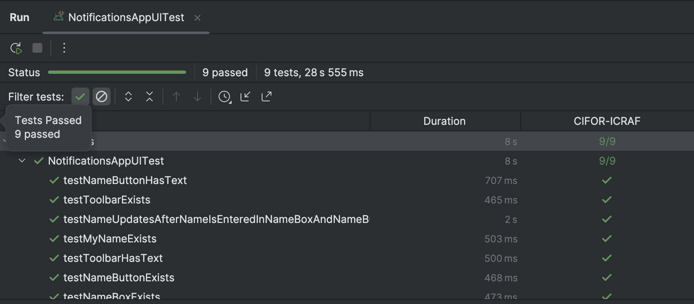
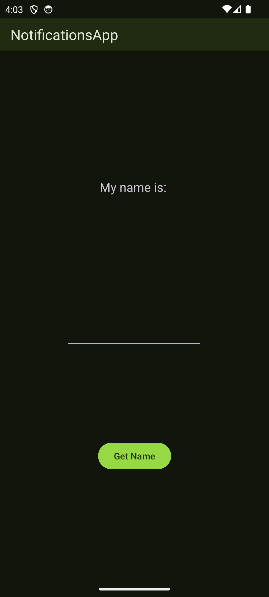
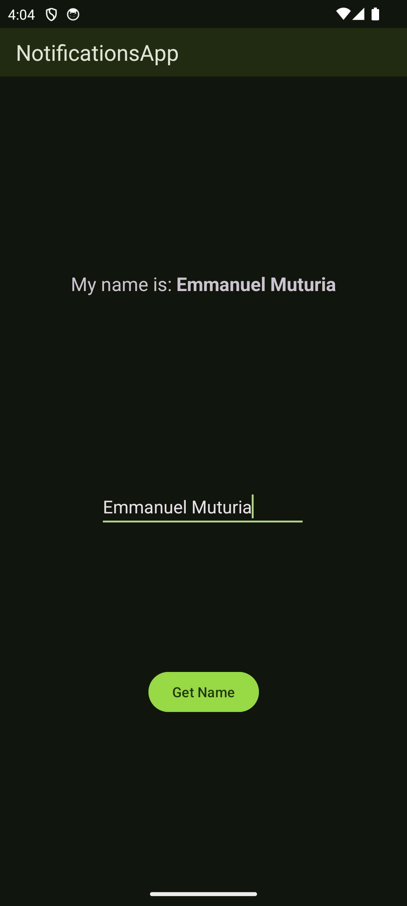

## Overview

NotificationsApp is an Android application that was built to test the feasibility of adding Push Notifications using Firebase Cloud Messaging (FCM)...

## Table of Contents

1. [Background](#background)
2. [Requirements](#requirements)
3. [Project Structure](#project-structure)
4. [Procedure](#procedure)
5. [Tests](#tests)
6. [Screenshots](#screenshots)
7. [Credits](#credits)

## Background

NotificationsApp was developed in preparation of the next release of the [Regreening app](https://play.google.com/store/apps/details?id=com.icraf.gsl.regreeningafrica) which was proposed to include Push notifications as a feature...

## Requirements

- These are the requirements for setting up the project:

### 1. Laptop
- The project requires a laptop with the minimum/recommended specifications set by Google for running Android Studio...

### 2. Android Studio
- This is the IDE used to run the project...
- Depending on the time of installation, the IDE may prompt you to update the project's Android Gradle Plugin (AGP) version...

### 3. Emulator/Physical Device (Android/iOS)
- To run the app, an Emulator provided by Android Studio or a physical device (USB/Wireless Debugging) is required...

## Project Structure

- Objects has one module (:app) that is divided into the following packages:

### i) feature

- This package mocks the conventional :feature module in a modularised project and is divided into: data (It contains the NotificationsAppService class which is used to configure the FCM implementation) and ui (It contains the HomeFragment which is essentially the only screen in the app)...

### ii) main

- This package contains the MainActivity (Entry Point of The App)...

## Procedure

- To set up the project, please follow this procedure:

1. ### The Cloning
- To clone the project from GitHub, open Android Studio and choose "Clone from Version Control"...
- When presented with the Dialog, copy anRd paste the following URL in the box requesting for the repository's URL: [git@github.com:gsl-icraf/Notification_App.git](git@github.com:gsl-icraf/Notification_App.git) for SSH and [https://github.com/gsl-icraf/Notification_App.git](https://github.com/gsl-icraf/Notification_App.git) for HTTPS...

### 2. The Setup
- Once the project is open in Android Studio, upgrade it to the latest AGP version if prompted and follow the steps presented using the AGP Assistant...

### 3. The Launch
- If you do not have an Emulator and would like to use it for running the app, then simply go to "Device Manager" on the right-hand panel of Android Studio and click the "+" icon to add a new Virtual Device. Choose your preferred device and configurations, including the System Image if you have none installed...
- If you would like to use a Physical Device insRtead, here are the two options you should use to connect it to Android Studio:

#### 1. USB Debugging
- Ensure that your device has "USB Debugging" enabled by first enabling Developer Options (Check your device's website for the steps you need to take for this) and navigating to the "Developer Options" section and toggling "USB Debugging" on...
- Connect your device to the laptop using a USB cable and select "Transfer Files"...
- That's it!

### 2. Wireless Debugging (Android 11+)
- To use Wireless Debugging instead, follow the above procedure but enable "Wireless Debugging" instead of "USB Debugging"...
- Once that is done, navigate to "Device Manager" and click the WiFi icon...
- You will be presented with a QR Code. On the "Developer Options" under "Wireless Debugging", choose "Pair using QR Code" and scan the QR code that has been presented to you in Android Studio. Alternatively, select the "Pair using Pairing Code" and do the same on your device still under "Wireless Debugging". Wait for Android Studio to scan and discover your device...
- That's it!

## Tests

| Test                                       | Description                   |
|--------------------------------------------|-------------------------------|
|  | These are the UI Tests...     |

## Screenshots

  
  

## Credits

- This project has been developed and supported by the following Tools, Technologies, and Libraries:

### 1. Kotlin

- [Kotlin](https://kotlinlang.org) was used due to its number of benefits including its ease of use...

### 2. Leak Canary

- [LeakCanary](https://square.github.io/leakcanary/) was used to detect and report Memory Leaks in the Android application...

### 3. Firebase Cloud Messaging

- [Firebase Cloud Messaging](https://firebase.google.com/docs/cloud-messaging) is a product of [Firebase](https://firebase.google.com) that was used to configure and send out Push Notifications...

### 4. JUnit and Espresso

- [JUnit](https://junit.org/junit4/) was used to run the Tests...
- [Espresso](https://developer.android.com/training/testing/espresso) was used to conduct the UI Tests...